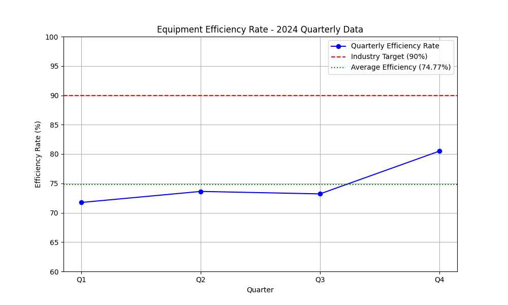

# Equipment Efficiency Analysis

This report provides an analysis of the equipment efficiency rate for the year 2024. The analysis is based on quarterly data and compares the company's performance against the industry target.

## Data Visualization

The following chart shows the trend of the equipment efficiency rate over the four quarters of 2024, along with the industry target and the average efficiency rate.

## Key Findings

- The equipment efficiency rate has shown an upward trend throughout the year, with a significant increase in Q4.
- The quarterly efficiency rates are as follows:
  - Q1: 71.75%
  - Q2: 73.63%
  - Q3: 73.21%
  - Q4: 80.49%
- The average efficiency rate for the year is **74.77%**.
- Despite the improvement, the average efficiency rate is still significantly below the industry target of **90%**.

## Business Implications

The current trend, while positive, indicates that the company is lagging behind the industry standard. This can lead to:

- **Increased operational costs:** Lower efficiency often means higher energy consumption, more waste, and increased maintenance costs.
- **Reduced competitiveness:** Competitors operating at or above the industry target are likely to have lower production costs and higher output.
- **Risk of production delays:** Inefficient equipment is more prone to breakdowns, which can lead to production stoppages and delays in fulfilling customer orders.

## Recommendations

To bridge the gap and reach the industry target of 90%, a proactive approach is necessary. The following recommendation is proposed:

**Implement a predictive maintenance program.**

A predictive maintenance program uses data analysis tools and techniques to detect anomalies in operation and possible defects in processes and equipment so that they can be fixed before they result in failure. This will help to:

- **Increase equipment uptime:** By predicting and preventing failures, the equipment will be available for production for a larger percentage of the time.
- **Reduce maintenance costs:** Maintenance will be performed when it is necessary, rather than on a fixed schedule, which can reduce unnecessary maintenance and prevent costly failures.
- **Improve safety:** A well-maintained equipment is less likely to cause safety incidents.

By implementing a predictive maintenance program, the company can expect to see a significant improvement in its equipment efficiency rate, which will lead to lower costs, increased production, and a stronger competitive position in the market.

---
*This analysis was prepared by a bot. For any questions, please contact 21f3001973@ds.study.iitm.ac.in.*
